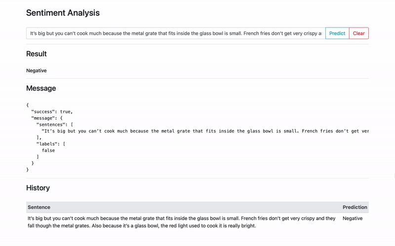

# Analysis of Fine-Tuning Techniques for Text Classification

## File Structure

    .
    ├── BERT.py                         # BERT class
    ├── ClassificationDataset.py        # dataset class
    ├── app.py                          # RESTful API server
    ├── data.py                         # fetch and preprocess datasets
    ├── plot.py                         # plot loss curves
    ├── finetune.py                     # finetune model
    ├── index.html                      # demo web application
    ├── pretrain.py                     # further pretrain model
    ├── requirements.txt                # python environment packages
    ├── test.py                         # test model
    ├── utilities.py                    # utility functions
    ├── datasets                        # folder to save preprocessed dataset
    ├── logs                            # folder to save logs
    └── models                          # folder to save models

## How To Run

### Install requirements

```bash
pip3 install -r requirements.txt
```

### Datasets

| Type | Name | Number of Classes | Number of Train Cases | Number of Test Cases |
| --- | --- | --- | --- | --- |
| Topic | AG_NEWS | 4 | 120000 | 7600 |
| Topic | DBpedia | 14 | 560000 | 70000 |
| Question | YahooAnswers | 10 | 1400000 | 60000 |
| Sentiment | YelpReviewPolarity | 2 | 560000 | 38000 |
| Sentiment | AmazonReviewFull | 5 | 300000 | 65000 |
| Sentiment | IMDB | 2 | 25000 | 25000 |

#### Fetch and encode datasets

```bash
python3 data.py -d <dataset_name> -s <split>
```  

example:

```bash
python3 data.py -d imdb -s train
```

### Pretrain

```bash
python3 pretrain.py -d <dataset_name> -c <num_class> -b <batch_size> -r <learning_rate>
```

example:

```bash
python3 pretrain.py -d imdb -c 2 -b 32 -r 2e-3
```

* for more arguments and explanation please check `pretrain.py`.

### Finetune

```bash
python3 finetune.py -d <dataset_name> -c <num_class> -b <batch_size> -r <learning_rate>
```

example:

```bash
python3 finetune.py -d imdb -c 2 -b 32 -r 2e-3
```

* for more arguments and explanation please check `finetune.py`.

### App

```bash
python3 app.py -m <model_path> -d <listen_address> -p <listen_port>
``` 

example:

```bash
python3 app.py
```

* model needed in this part can be downloaded
  from [Google Drive](https://drive.google.com/file/d/123w7-nKRKrcWkshalH39qMkbfOsRe-Q9/view?usp=sharing).

## Usage

The API "/predict" requires POST method, and takes json containing key "sentences" of a list of string as input,
returning json containing "sentences" and corresponding predicted "labels".

sample input

```json
{
  "sentences": [
    "I have the older version of this and it works great. I love being able to see my food while it’s cooking and have cooked chicken, fries, baked potatoes, biscuits and many other things. Also you can cook more at one time than in other air fryers. Love how it is so easy to clean.",
    "It’s big but you can’t cook much because the metal grate that fits inside the glass bowl is small. French fries don’t get very crispy and they fall though the metal grates. Also because it’s a glass bowl, the red light used to cook it is really bright."
  ]
}
```

sample output

```json
{
  "success": true,
  "message": {
    "sentences": [
      "I have the older version of this and it works great. I love being able to see my food while it’s cooking and have cooked chicken, fries, baked potatoes, biscuits and many other things. Also you can cook more at one time than in other air fryers. Love how it is so easy to clean.",
      "It’s big but you can’t cook much because the metal grate that fits inside the glass bowl is small. French fries don’t get very crispy and they fall though the metal grates. Also because it’s a glass bowl, the red light used to cook it is really bright."
    ],
    "labels": [
      true,
      false
    ]
  }
}
```

## Demo web application



## Performance Evaluation

|  | YelpReviewPolarity | AmazonReviewFull | IMDB |
| --- | --- | --- | --- |
| None | 0.906289474 | 0.507292308 | 0.8578 |
| YelpReviewPolarity | 0.973921053 | 0.583553846 | 0.92456 |
| AmazonReviewFull | 0.957789474 | **0.637030769** | 0.9404 |
| IMDB | 0.930631579 | 0.541938462 | 0.93404 |
| All except Yelp | 0.950105263 | - | - |
| All except Amazon | - | 0.583692308 | - |
| All except IMDB | - | - | 0.937 |
| All| **0.975394737** | 0.625107692 | **0.94276** |

The table above shows the best test accuracy reached with different further pre-train datasets. The first row indicates
the fine-tuning dataset, and the first columns indicates the further pre-training datasets. We discovered that further
pre-training with different datasets within the same task help create a more generalized model that has decent
performance on more than one dataset.
